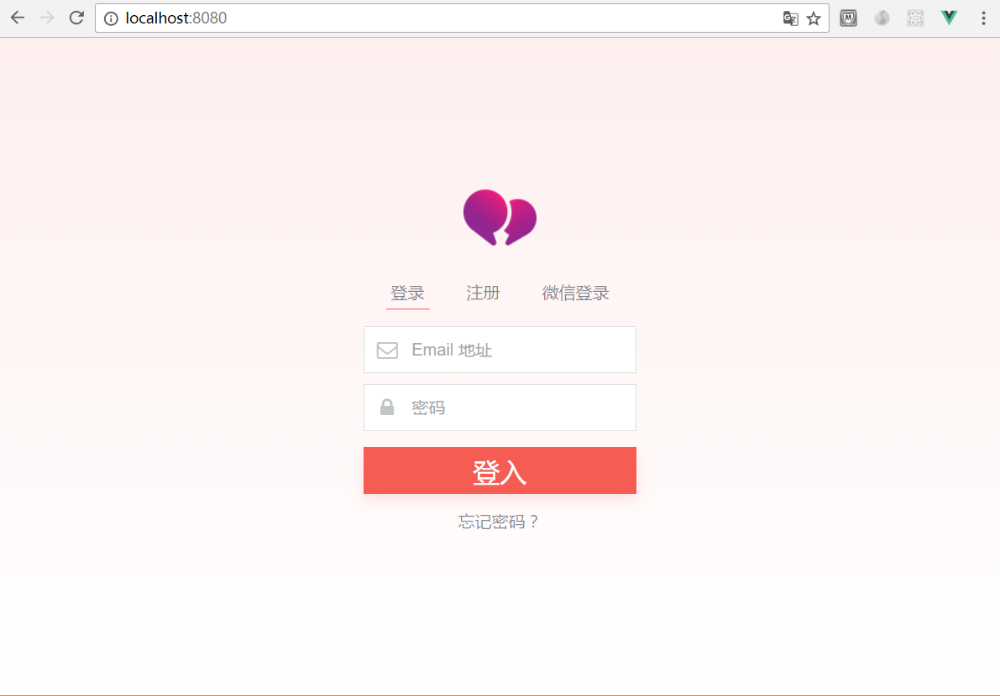

# Mechat-desktop

An example built with Vue 2.0 + vuex.

<p align="center">
    
    
</p>

## Build Setup

**Requires Node.js 6+**

``` bash
# install dependencies
npm install # or yarn

# serve in dev mode, with hot reload at localhost:8080
npm run dev

# build for production
npm run build

# serve in production mode
npm start
```
